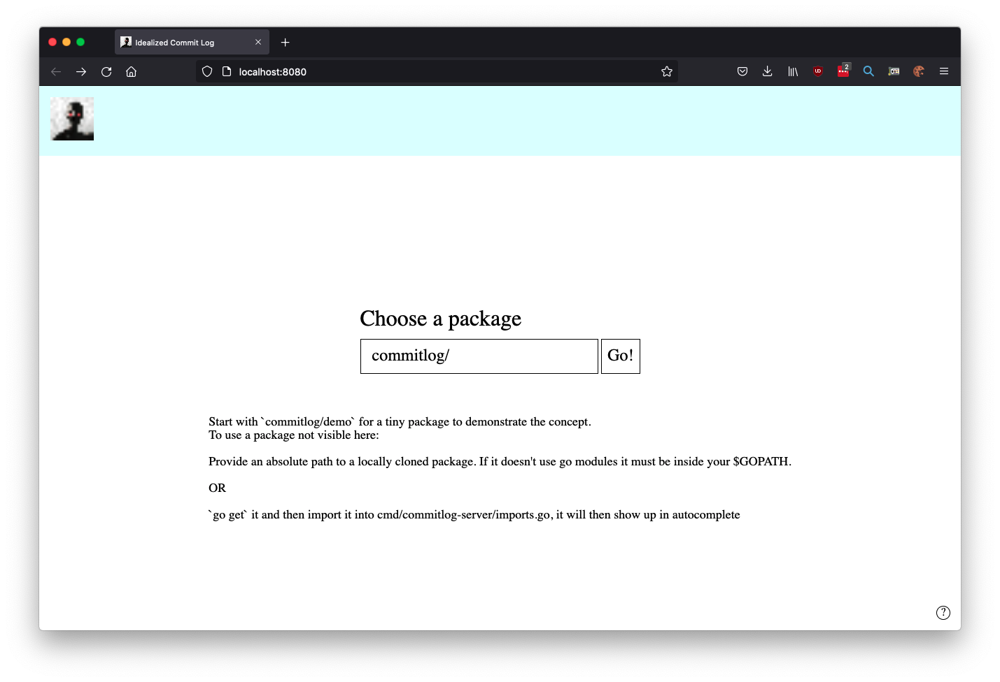
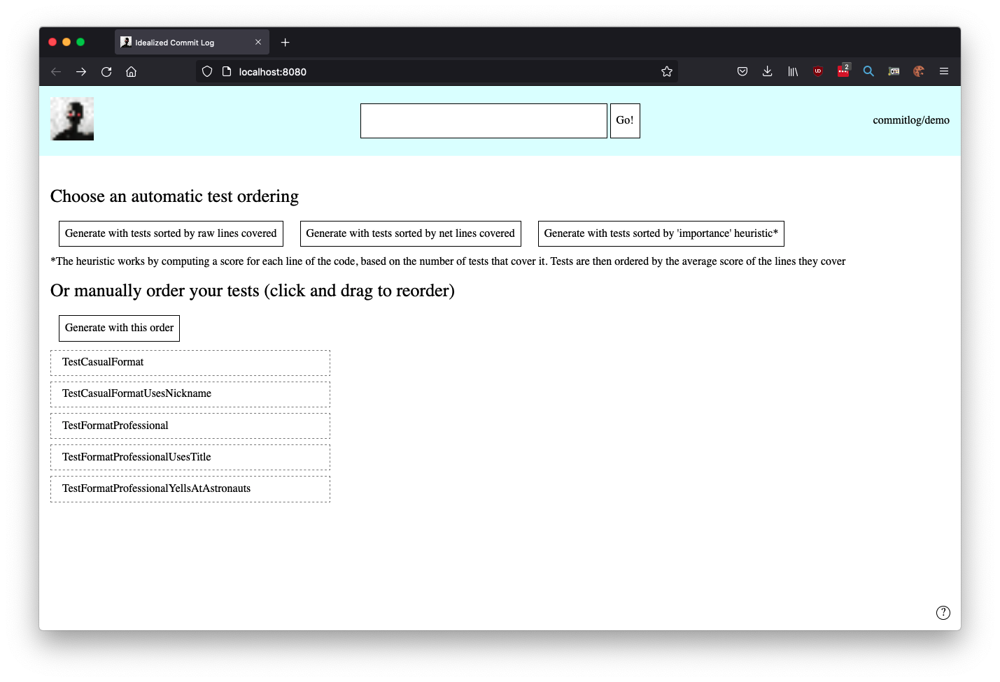
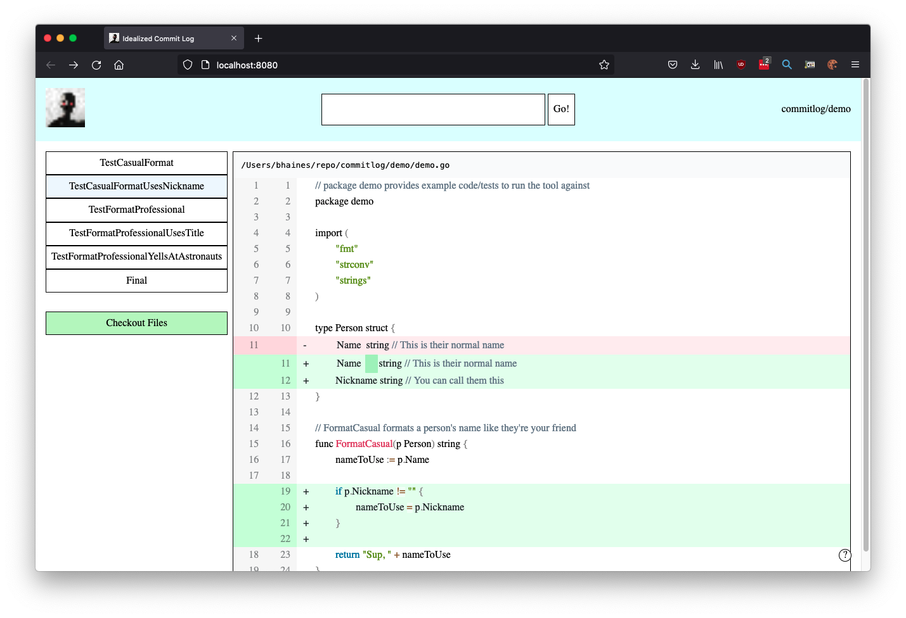

# Idealized Commit Logs

This repo is an implementation of the idea of 'idealized commit logs' as described in this talk by Alan Shreve. 

 

## Summary

It is challenging to look at unfamiliar code and build a mental model of how the code works. In theory mature code bases consist of core logic accompanied by layers of logic for edge cases / compatibility / infrequently used features that distract from building a useful mental model.

The goal is to construct a commit log that can assist someone in reading the code. The first commit in the 'ideal' log will contain the code that represents the core functionality of the program. Later commits incrementally add code until the full codebase is recreated.

To accomplish this the user provides an ordering for a package's unit tests; each commit in our idealized log is constructed by computing the code coverage of the test and adding it to the code covered by previous tests. There are also some heuristics implemented to try and automatically pick useful test orderings.

For full details watch the talk: https://www.youtube.com/watch?v=dSqLt8BgbRQ

## Screenshots

## Running

There are two parts, a go backend and a react frontend.

To run everything you'll need node version 14+ and go version 1.16+.

1. Clone the repo.
2. Install javascript dependencies by running `npm install` or `yarn install`
3. Start the backend by running `go run .` inside `cmd/commitlog-server/`
4. Start the frontend by running `npm run start` or `yarn start` in `frontend/`
5. Visit `http://localhost:8080`
